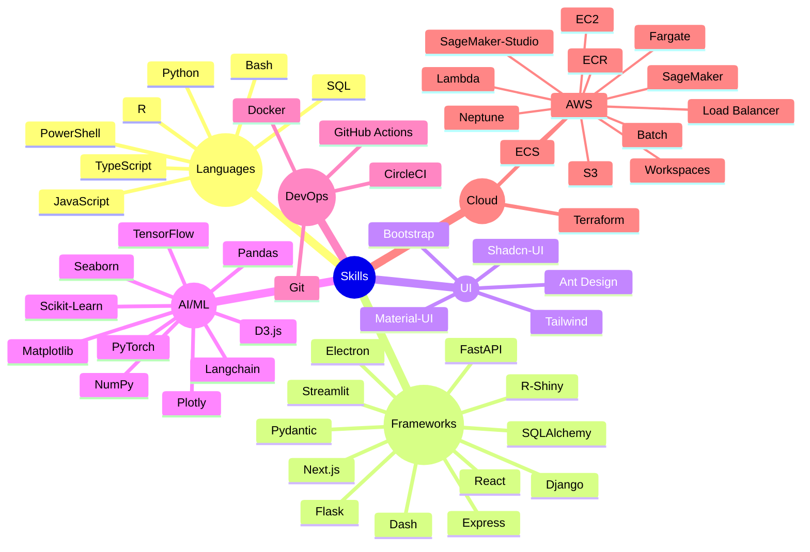

## Hi there 👋

```mermaid
mindmap
  root((Skills))
    ((Languages))
      Python
      JavaScript
      TypeScript
      R
      SQL
      Bash
      PowerShell
    ((Frameworks))
      React
      Flask
      Django
      FastAPI
      Express
      Electron
      Next.js
      Dash
      R-Shiny
      Streamlit
      Pydantic
      SQLAlchemy
    ((UI))
      Material-UI
      Tailwind
      Shadcn-UI
      Ant Design
      Bootstrap
    ((AI/ML))
      PyTorch
      TensorFlow
      Plotly
      D3.js
      Pandas
      NumPy
      Matplotlib
      Seaborn
      Scikit-Learn
      Langchain
    ((DevOps))
      Git
      Docker
      CircleCI
      GitHub Actions
    ((Cloud))
      AWS
        S3
        Lambda
        SageMaker
        SageMaker-Studio
        Batch
        ECR
        Fargate
        EC2
        Workspaces
        Neptune
        ECS
        Load Balancer
      Terraform
```

