```mermaid
%%{init: {
  "theme": "base",
  "themeVariables": {
    "background": "transparent",
    "primaryColor": "#E6F4FF",
    "secondaryColor": "#F1F5F9",
    "tertiaryColor": "#EEF2F7",
    "primaryTextColor": "#0B1221",
    "lineColor": "#94A3B8",
    "fontFamily": "Inter, Segoe UI, Arial",
    "fontSize": "14px"
  }
}}%%
mindmap
  root(( 🛰️ Gökay Yılmaz — AI Engineer & Builder))
    ((🧠 Core Strengths))
      Problem Solving
      System Design
      Scalability
      Innovation
      Leadership
      Communication
      Growth Mindset
      Mentorship
      Entrepreneurship
    ((💻 Languages))
      Python
      JavaScript
      C++
      Rust
      SQL
      Bash
      PowerShell
    ((⚙️ Frameworks & Libraries))
      React
      Next.js
      Electron
      Flask
      Django
      FastAPI
      Express
    ((🎨 UI / UX))
      Material-UI
      TailwindCSS
      Shadcn-UI
      Ant Design
      Bootstrap
      Figma
    ((🤖 AI / ML))
      PyTorch
      TensorFlow
      Langchain
      LLM Ops/Inference
      Finetuning
      Seaborn
      Plotly
      Transformers
      OpenAI API Server
      Hugging Face
    ((☁️ Cloud & DevOps))
      ((AWS))
        S3
        Lambda
        SageMaker
        ECS
        Fargate
        EC2
        Load Balancer
        ECR
        Batch
        Workspaces
        Neptune
      Docker
      GitHub Actions
      CircleCI
      Kubernetes
      Rancher
      Apache APISIX
    ((🧩 Architecture & Tools))
      Microservices
      RESTful APIs
      WebSockets
      Message Queues (RabbitMQ / Kafka)
      Redis
      PostgreSQL
      MongoDB
      ChromaDB
    ((🚀 Personal Traits))
      Problem Solver
      Systems Thinker
      Impact Oriented
      End-to-End Builder
      AI & Data Enthusiast
      Open Source Contributor
      Startup DNA
      Always Shipping

```
  

  
  
  
  
  
  
  
  
  
  
  
  
  
  
  
  
  
  
  
  
  

###

  

###

  
  

 
 

<picture>
  <source media="(prefers-color-scheme: dark)" srcset="https://raw.githubusercontent.com/gkyela/gkyela/output/snake-dark.svg" />
  <source media="(prefers-color-scheme: light)" srcset="https://raw.githubusercontent.com/gkyela/gkyela/output/snake.svg" />
  
</picture>
